# 🏗️ Okuz AI - System Architecture

## 📋 İçindekiler

- [Genel Mimari](#genel-mimari)
- [Microservices Detayları](#microservices-detayları)
- [Veri Akışı](#veri-akışı)
- [Güvenlik Mimarisi](#güvenlik-mimarisi)
- [Deployment Mimarisi](#deployment-mimarisi)

## 🏛️ Genel Mimari

### Sistem Genel Bakış

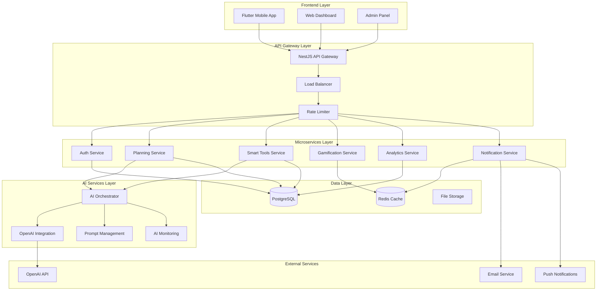

### Katman Mimarisi

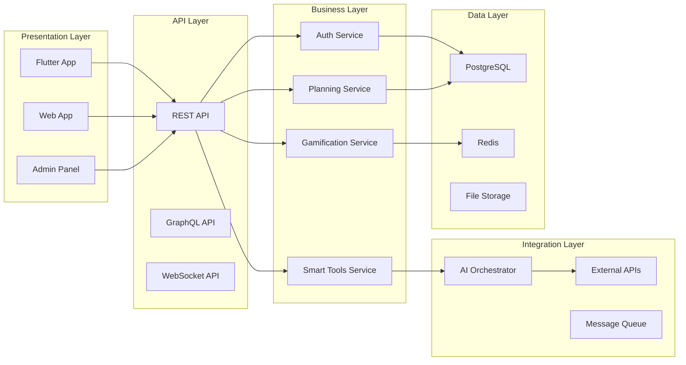

## 🔧 Microservices Detayları

### 1. Authentication Service

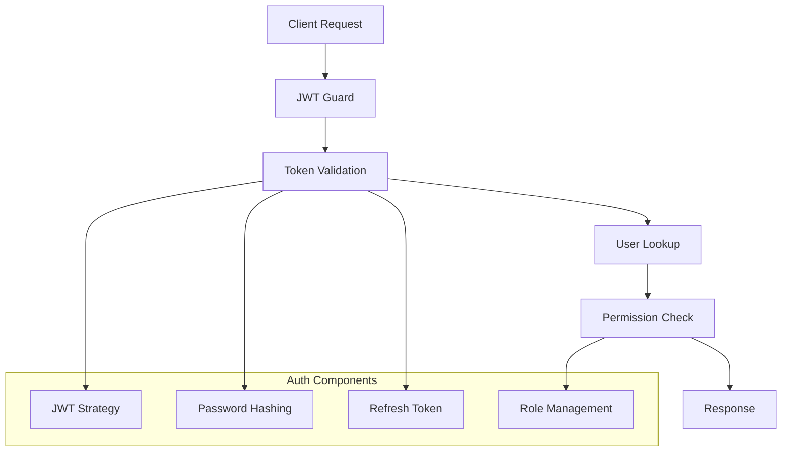

**Özellikler:**
- JWT token tabanlı kimlik doğrulama
- Role-based access control (RBAC)
- Refresh token mekanizması
- Password hashing (bcrypt)
- Session management

### 2. Planning Service

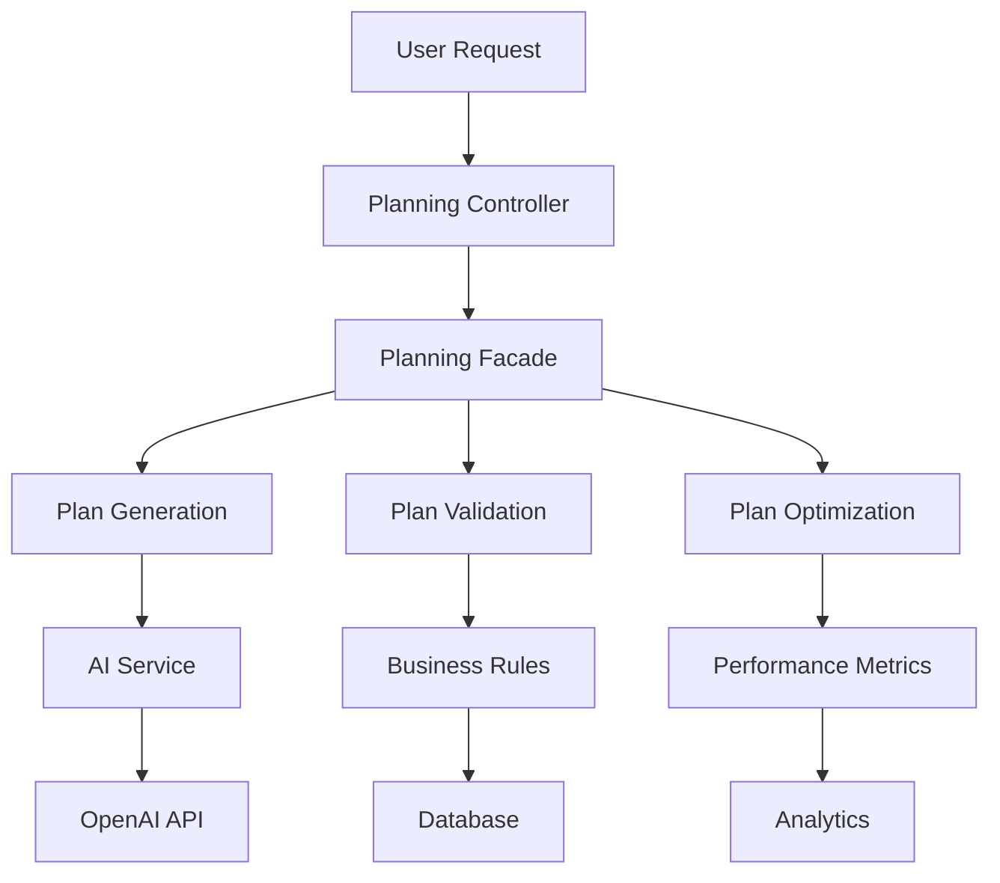

**Özellikler:**
- AI-powered plan generation
- Plan validation ve optimization
- Progress tracking
- Adaptive learning
- Performance analytics

### 3. Smart Tools Service

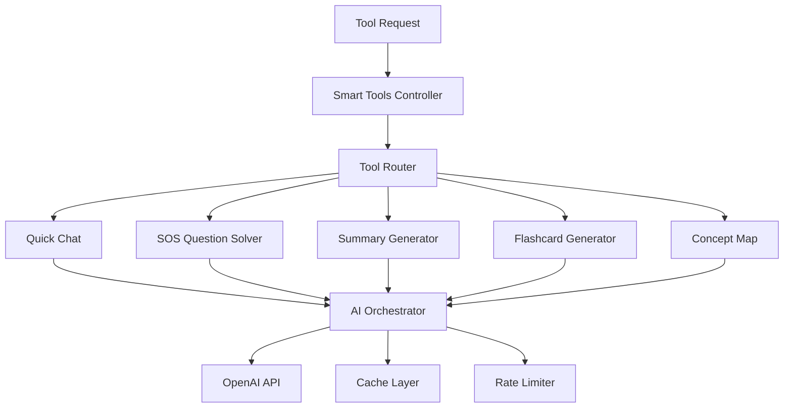

**Özellikler:**
- AI-powered content generation
- Real-time question solving
- Document summarization
- Interactive learning tools
- Caching ve rate limiting

### 4. Gamification Service

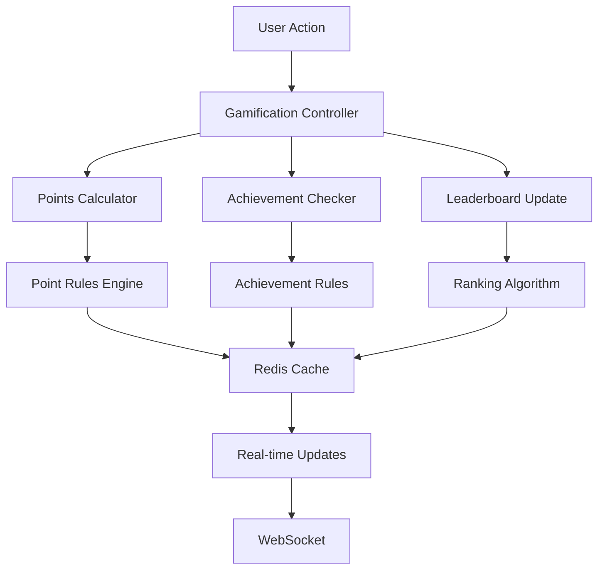

**Özellikler:**
- Point system
- Achievement system
- Leaderboards
- Badge management
- Real-time updates

## 🔄 Veri Akışı

### 1. Kullanıcı Kayıt ve Giriş Akışı

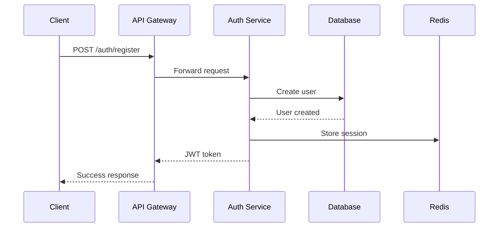

### 2. Plan Oluşturma Akışı

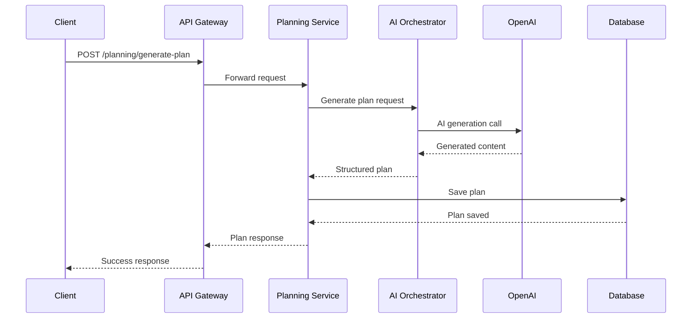

### 3. Smart Tools Kullanım Akışı

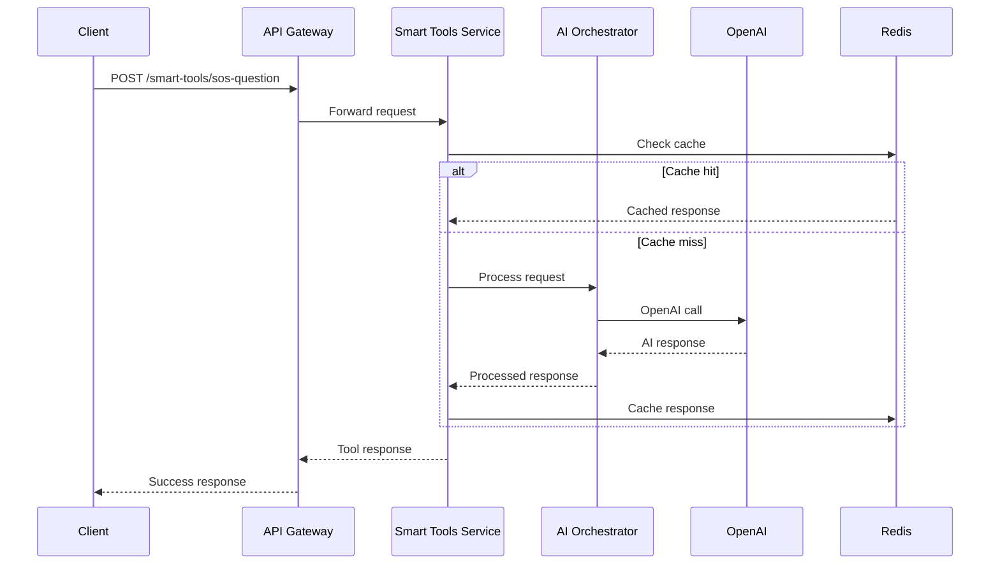

## 🔐 Güvenlik Mimarisi

### Güvenlik Katmanları

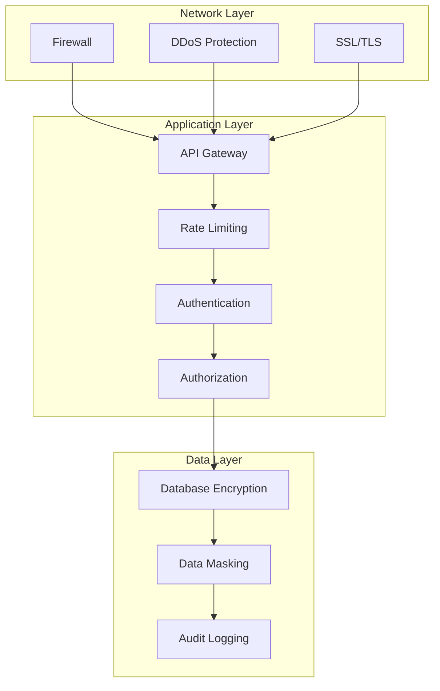

### JWT Token Akışı

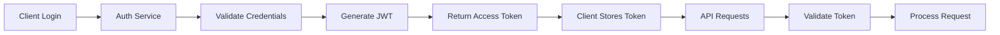

## 🚀 Deployment Mimarisi

### Production Environment

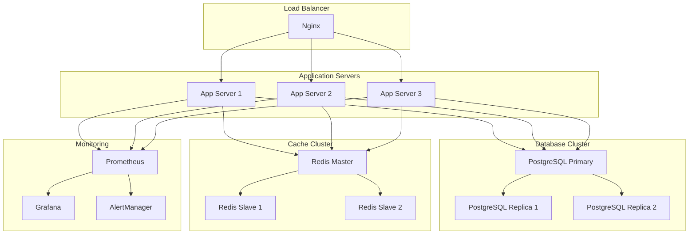

### Kubernetes Deployment

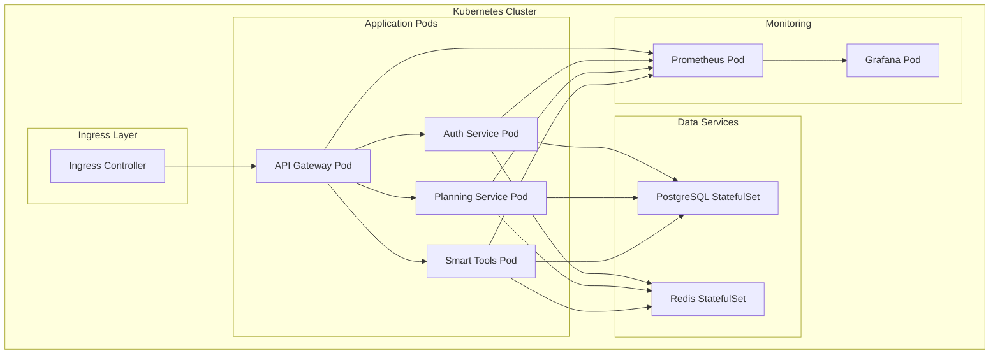

## 📊 Performance Architecture

### Caching Strategy

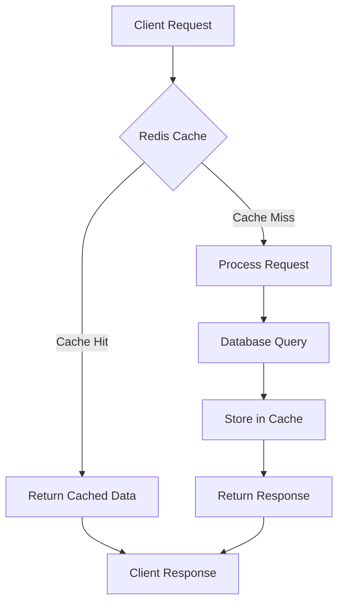

### Load Balancing

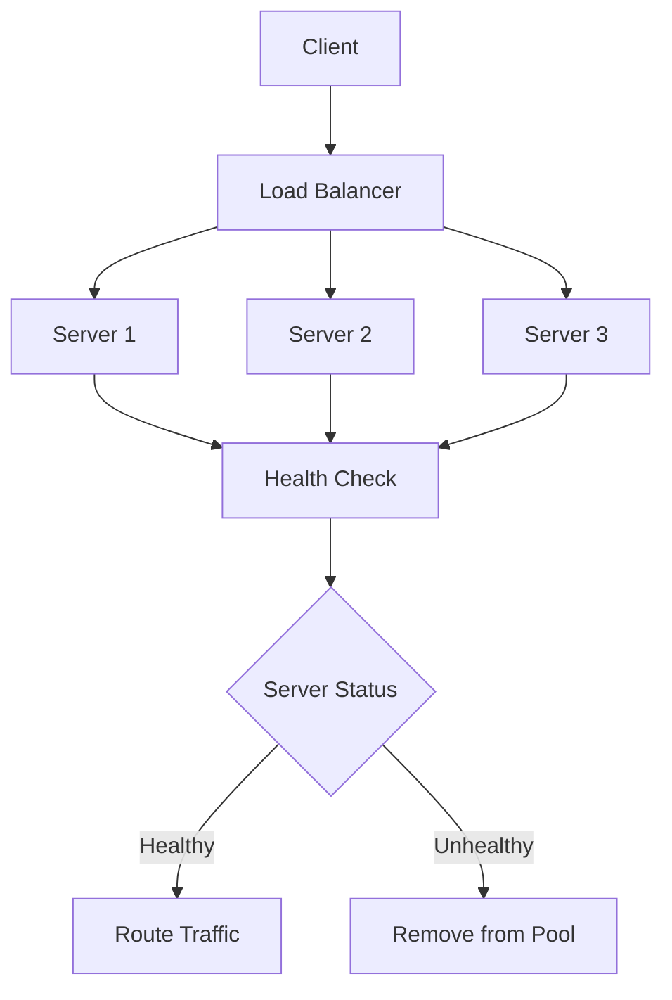

## 🔄 CI/CD Pipeline

### Deployment Pipeline

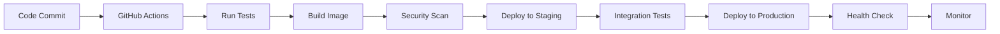

## 📈 Monitoring ve Observability

### Monitoring Stack

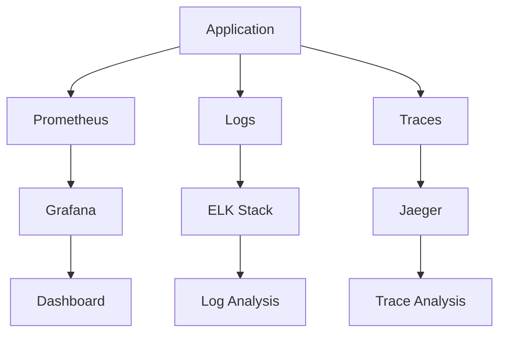

Bu mimari dokümantasyonu, Okuz AI sisteminin tüm bileşenlerini, aralarındaki ilişkileri ve veri akışını detaylı bir şekilde açıklamaktadır. Sistemin ölçeklenebilir, güvenli ve yüksek performanslı olması için tasarlanmıştır.
