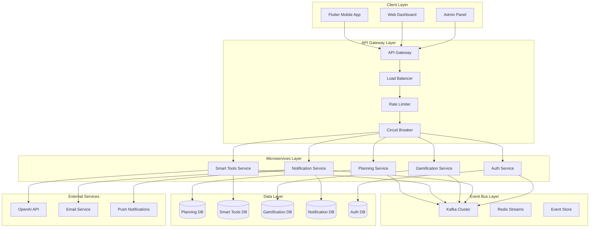
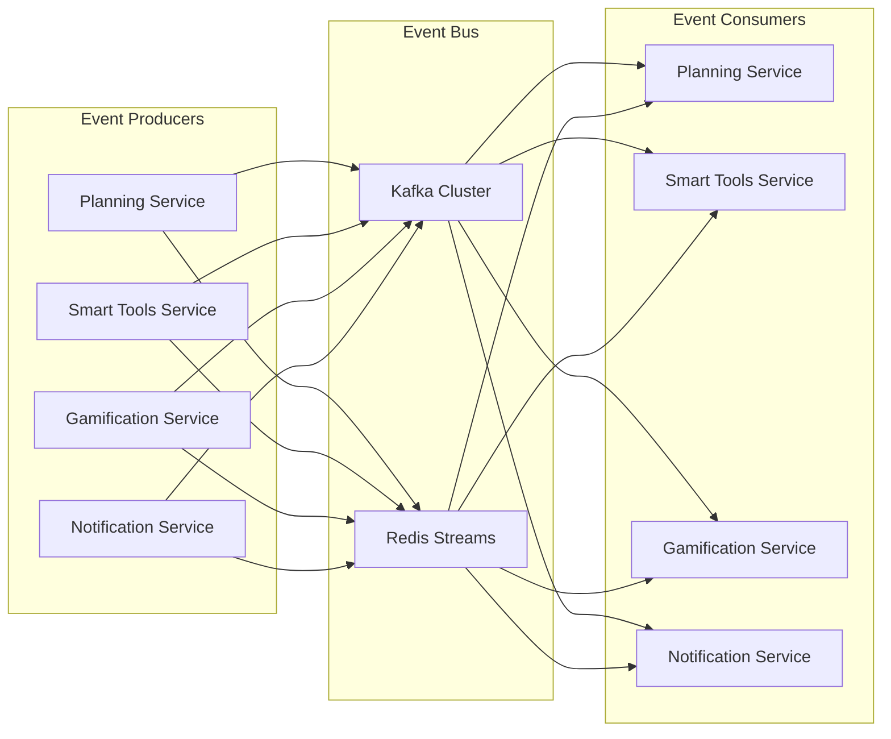
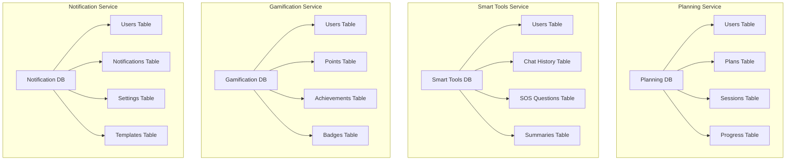

# 🏗️ Okuz AI - Microservices Architecture

## 📋 İçindekiler

- [Mikroservis Mimarisi Genel Bakış](#mikroservis-mimarisi-genel-bakış)
- [Servis Detayları](#servis-detayları)
- [Event-Driven İletişim](#event-driven-iletişim)
- [Database per Service](#database-per-service)
- [API Gateway](#api-gateway)
- [Deployment Stratejisi](#deployment-stratejisi)
- [Monitoring ve Observability](#monitoring-ve-observability)

## 🏛️ Mikroservis Mimarisi Genel Bakış

### Mimari Diyagramı



### Servis Kategorileri

| Servis | Sorumluluk | Teknoloji | Database |
|--------|------------|-----------|----------|
| **API Gateway** | Routing, Auth, Rate Limiting | NestJS | - |
| **Planning Service** | Study plans, scheduling | NestJS | PostgreSQL |
| **Smart Tools Service** | AI tools, content generation | NestJS | PostgreSQL |
| **Gamification Service** | Points, badges, achievements | NestJS | PostgreSQL |
| **Notification Service** | Notifications, messaging | NestJS | PostgreSQL |
| **Auth Service** | Authentication, authorization | NestJS | PostgreSQL |

## 🔧 Servis Detayları

### 1. API Gateway Service

**Sorumluluklar:**
- Tüm gelen istekleri yönlendirme
- Authentication ve authorization
- Rate limiting ve throttling
- Circuit breaker pattern
- Load balancing
- Request/response transformation

**Teknoloji Stack:**
- **Framework**: NestJS
- **Authentication**: JWT
- **Rate Limiting**: @nestjs/throttler
- **Circuit Breaker**: Custom implementation
- **Load Balancer**: Custom implementation

**Konfigürasyon:**
```yaml
# Environment Variables
NODE_ENV=production
PORT=3000
JWT_SECRET=your-jwt-secret
REDIS_URL=redis://localhost:6379
PLANNING_SERVICE_URL=http://planning-service:3001
SMART_TOOLS_SERVICE_URL=http://smart-tools-service:3002
GAMIFICATION_SERVICE_URL=http://gamification-service:3003
NOTIFICATION_SERVICE_URL=http://notification-service:3004
AUTH_SERVICE_URL=http://auth-service:3005
```

### 2. Planning Service

**Sorumluluklar:**
- Study plan generation
- Plan optimization
- Progress tracking
- Session management
- Plan analytics

**Database Schema:**
- **Users**: Minimal user data
- **Plans**: Study plans
- **StudySessions**: Individual study sessions
- **Progress**: Progress tracking
- **PlanAnalytics**: Analytics data

**Event Publishing:**
- `planning.plan.created`
- `planning.plan.updated`
- `planning.plan.deleted`
- `planning.session.completed`

### 3. Smart Tools Service

**Sorumluluklar:**
- AI-powered question solving
- Content generation
- Summarization
- Flashcard generation
- Concept mapping

**Database Schema:**
- **Users**: Minimal user data
- **ChatHistory**: Chat conversations
- **SosQuestions**: SOS questions
- **Summaries**: Generated summaries
- **Flashcards**: Generated flashcards
- **ConceptMaps**: Concept maps

**Event Publishing:**
- `smart-tools.chat.completed`
- `smart-tools.sos.resolved`
- `smart-tools.summary.generated`

### 4. Gamification Service

**Sorumluluklar:**
- Points system
- Achievement system
- Badge management
- Leaderboards
- Streak tracking

**Database Schema:**
- **Users**: Minimal user data
- **UserPoints**: Points tracking
- **Achievements**: Achievement definitions
- **UserAchievements**: User achievements
- **Badges**: Badge definitions
- **UserBadges**: User badges
- **Leaderboard**: Leaderboard entries

**Event Publishing:**
- `gamification.points.updated`
- `gamification.achievement.earned`
- `gamification.badge.earned`
- `gamification.streak.updated`

### 5. Notification Service

**Sorumluluklar:**
- Email notifications
- Push notifications
- SMS notifications
- In-app notifications
- Notification templates

**Database Schema:**
- **Users**: Minimal user data
- **Notifications**: Notification records
- **NotificationSettings**: User preferences
- **NotificationTemplates**: Message templates
- **NotificationCampaigns**: Campaign management

**Event Publishing:**
- `notification.sent`
- `notification.delivered`
- `notification.read`
- `notification.failed`

## 🔄 Event-Driven İletişim

### Event Bus Architecture



### Event Types

#### Planning Events
- `planning.plan.created`
- `planning.plan.updated`
- `planning.plan.deleted`
- `planning.session.completed`
- `planning.progress.updated`

#### Smart Tools Events
- `smart-tools.chat.completed`
- `smart-tools.sos.resolved`
- `smart-tools.summary.generated`
- `smart-tools.flashcards.generated`
- `smart-tools.concept-map.generated`

#### Gamification Events
- `gamification.points.updated`
- `gamification.achievement.earned`
- `gamification.badge.earned`
- `gamification.streak.updated`
- `gamification.level.up`

#### Notification Events
- `notification.sent`
- `notification.delivered`
- `notification.read`
- `notification.failed`

### Event Schema

```typescript
interface Event {
  id: string;
  type: string;
  service: string;
  timestamp: Date;
  data: any;
  metadata?: Record<string, any>;
}
```

### Event Handling

```typescript
// Event Publisher
async publishEvent(event: Event): Promise<void> {
  await this.kafka.producer.send({
    topic: 'events',
    messages: [{
      key: event.id,
      value: JSON.stringify(event),
      headers: {
        'event-type': event.type,
        'service': event.service,
        'timestamp': event.timestamp.toISOString(),
      },
    }],
  });
}

// Event Consumer
async handleEvent(event: Event): Promise<void> {
  switch (event.type) {
    case 'planning.plan.created':
      await this.handlePlanCreated(event);
      break;
    case 'gamification.achievement.earned':
      await this.handleAchievementEarned(event);
      break;
    // ... other event handlers
  }
}
```

## 🗄️ Database per Service

### Database Separation Strategy



### Database Schemas

#### Planning Service Database
```sql
-- Users table (minimal user data)
CREATE TABLE users (
    id UUID PRIMARY KEY,
    email VARCHAR(255) UNIQUE NOT NULL,
    name VARCHAR(255) NOT NULL,
    role user_role NOT NULL,
    created_at TIMESTAMP DEFAULT NOW(),
    updated_at TIMESTAMP DEFAULT NOW()
);

-- Plans table
CREATE TABLE plans (
    id UUID PRIMARY KEY,
    user_id UUID REFERENCES users(id),
    title VARCHAR(255) NOT NULL,
    description TEXT,
    subjects TEXT[] NOT NULL,
    goals TEXT[] NOT NULL,
    start_date DATE NOT NULL,
    end_date DATE NOT NULL,
    is_active BOOLEAN DEFAULT true,
    created_at TIMESTAMP DEFAULT NOW()
);

-- Study sessions table
CREATE TABLE study_sessions (
    id UUID PRIMARY KEY,
    plan_id UUID REFERENCES plans(id),
    user_id UUID REFERENCES users(id),
    subject VARCHAR(100) NOT NULL,
    topic VARCHAR(255) NOT NULL,
    duration INTEGER NOT NULL,
    start_time TIMESTAMP NOT NULL,
    end_time TIMESTAMP NOT NULL,
    is_completed BOOLEAN DEFAULT false,
    created_at TIMESTAMP DEFAULT NOW()
);
```

#### Smart Tools Service Database
```sql
-- Users table (minimal user data)
CREATE TABLE users (
    id UUID PRIMARY KEY,
    email VARCHAR(255) UNIQUE NOT NULL,
    name VARCHAR(255) NOT NULL,
    role user_role NOT NULL,
    created_at TIMESTAMP DEFAULT NOW(),
    updated_at TIMESTAMP DEFAULT NOW()
);

-- Chat history table
CREATE TABLE chat_history (
    id UUID PRIMARY KEY,
    user_id UUID REFERENCES users(id),
    message TEXT NOT NULL,
    response TEXT NOT NULL,
    context TEXT,
    tool_type tool_type NOT NULL,
    created_at TIMESTAMP DEFAULT NOW()
);

-- SOS questions table
CREATE TABLE sos_questions (
    id UUID PRIMARY KEY,
    user_id UUID REFERENCES users(id),
    question TEXT NOT NULL,
    answer TEXT NOT NULL,
    subject VARCHAR(100) NOT NULL,
    grade INTEGER NOT NULL,
    difficulty difficulty_level DEFAULT 'MEDIUM',
    is_resolved BOOLEAN DEFAULT false,
    created_at TIMESTAMP DEFAULT NOW()
);
```

### Data Consistency

#### Eventual Consistency
- Services communicate through events
- Data consistency is maintained through event processing
- Eventual consistency is acceptable for most use cases

#### Saga Pattern
- For critical operations requiring strong consistency
- Implemented through event choreography
- Each service handles its part of the saga

#### CQRS (Command Query Responsibility Segregation)
- Separate read and write models
- Optimized for specific use cases
- Better performance and scalability

## 🚀 Deployment Stratejisi

### Kubernetes Deployment

```yaml
# API Gateway Deployment
apiVersion: apps/v1
kind: Deployment
metadata:
  name: api-gateway
  namespace: okuz-ai
spec:
  replicas: 3
  selector:
    matchLabels:
      app: api-gateway
  template:
    metadata:
      labels:
        app: api-gateway
    spec:
      containers:
      - name: api-gateway
        image: okuz-ai/api-gateway:latest
        ports:
        - containerPort: 3000
        env:
        - name: NODE_ENV
          value: "production"
        - name: PLANNING_SERVICE_URL
          value: "http://planning-service:3001"
        - name: SMART_TOOLS_SERVICE_URL
          value: "http://smart-tools-service:3002"
        - name: GAMIFICATION_SERVICE_URL
          value: "http://gamification-service:3003"
        - name: NOTIFICATION_SERVICE_URL
          value: "http://notification-service:3004"
        - name: AUTH_SERVICE_URL
          value: "http://auth-service:3005"
        resources:
          requests:
            memory: "256Mi"
            cpu: "250m"
          limits:
            memory: "512Mi"
            cpu: "500m"
```

### Service Discovery

```yaml
# Service Discovery Configuration
apiVersion: v1
kind: ConfigMap
metadata:
  name: service-discovery
  namespace: okuz-ai
data:
  services.yaml: |
    services:
      - name: planning-service
        url: http://planning-service:3001
        health: /health
      - name: smart-tools-service
        url: http://smart-tools-service:3002
        health: /health
      - name: gamification-service
        url: http://gamification-service:3003
        health: /health
      - name: notification-service
        url: http://notification-service:3004
        health: /health
      - name: auth-service
        url: http://auth-service:3005
        health: /health
```

### Load Balancing

```yaml
# Load Balancer Configuration
apiVersion: v1
kind: Service
metadata:
  name: api-gateway-service
  namespace: okuz-ai
spec:
  selector:
    app: api-gateway
  ports:
  - port: 80
    targetPort: 3000
  type: LoadBalancer
```

## 📊 Monitoring ve Observability

### Health Checks

```typescript
// Health Check Implementation
@Controller('health')
export class HealthController {
  constructor(
    private readonly prismaHealth: PrismaHealthIndicator,
    private readonly redisHealth: RedisHealthIndicator,
    private readonly kafkaHealth: KafkaHealthIndicator,
  ) {}

  @Get()
  @HealthCheck()
  check() {
    return this.health.check([
      () => this.prismaHealth.isHealthy('database'),
      () => this.redisHealth.isHealthy('redis'),
      () => this.kafkaHealth.isHealthy('kafka'),
    ]);
  }
}
```

### Metrics Collection

```typescript
// Metrics Implementation
@Injectable()
export class MetricsService {
  private readonly requestCounter = new prometheus.Counter({
    name: 'http_requests_total',
    help: 'Total number of HTTP requests',
    labelNames: ['method', 'route', 'status'],
  });

  private readonly requestDuration = new prometheus.Histogram({
    name: 'http_request_duration_seconds',
    help: 'HTTP request duration in seconds',
    labelNames: ['method', 'route'],
  });

  incrementRequestCounter(method: string, route: string, status: number) {
    this.requestCounter.inc({ method, route, status });
  }

  recordRequestDuration(method: string, route: string, duration: number) {
    this.requestDuration.observe({ method, route }, duration);
  }
}
```

### Logging

```typescript
// Structured Logging
@Injectable()
export class LoggingService {
  private readonly logger = new Logger(LoggingService.name);

  logRequest(req: Request, res: Response, next: NextFunction) {
    const start = Date.now();
    
    res.on('finish', () => {
      const duration = Date.now() - start;
      
      this.logger.log({
        method: req.method,
        url: req.url,
        status: res.statusCode,
        duration,
        userAgent: req.get('User-Agent'),
        ip: req.ip,
      });
    });
    
    next();
  }
}
```

### Tracing

```typescript
// Distributed Tracing
@Injectable()
export class TracingService {
  private readonly tracer = new Tracer({
    serviceName: 'okuz-ai-service',
    sampler: new AlwaysOnSampler(),
    reporter: new ZipkinReporter({
      url: 'http://zipkin:9411/api/v2/spans',
    }),
  });

  createSpan(operationName: string, parentSpan?: Span): Span {
    return this.tracer.startSpan(operationName, {
      childOf: parentSpan,
    });
  }
}
```

## 🔧 Development Workflow

### Local Development

```bash
# Start all services locally
docker-compose up -d

# Start individual services
npm run start:dev:api-gateway
npm run start:dev:planning
npm run start:dev:smart-tools
npm run start:dev:gamification
npm run start:dev:notification
npm run start:dev:auth
```

### Testing

```bash
# Run unit tests
npm run test:unit

# Run integration tests
npm run test:integration

# Run e2e tests
npm run test:e2e

# Run tests for specific service
npm run test:planning
npm run test:smart-tools
npm run test:gamification
```

### CI/CD Pipeline

```yaml
# GitHub Actions Workflow
name: Microservices CI/CD

on:
  push:
    branches: [main, develop]
  pull_request:
    branches: [main]

jobs:
  test:
    runs-on: ubuntu-latest
    strategy:
      matrix:
        service: [api-gateway, planning, smart-tools, gamification, notification, auth]
    steps:
      - uses: actions/checkout@v3
      - name: Setup Node.js
        uses: actions/setup-node@v3
        with:
          node-version: '18'
      - name: Install dependencies
        run: npm ci
      - name: Run tests
        run: npm run test:${{ matrix.service }}

  build:
    needs: test
    runs-on: ubuntu-latest
    strategy:
      matrix:
        service: [api-gateway, planning, smart-tools, gamification, notification, auth]
    steps:
      - uses: actions/checkout@v3
      - name: Build Docker image
        run: |
          docker build -t okuz-ai/${{ matrix.service }}:latest \
            -f services/${{ matrix.service }}/Dockerfile .
      - name: Push to registry
        run: |
          docker push okuz-ai/${{ matrix.service }}:latest

  deploy:
    needs: build
    runs-on: ubuntu-latest
    if: github.ref == 'refs/heads/main'
    steps:
      - name: Deploy to production
        run: |
          kubectl apply -f k8s/
          kubectl rollout restart deployment/api-gateway
          kubectl rollout restart deployment/planning-service
          kubectl rollout restart deployment/smart-tools-service
          kubectl rollout restart deployment/gamification-service
          kubectl rollout restart deployment/notification-service
          kubectl rollout restart deployment/auth-service
```

## 📚 Best Practices

### 1. Service Design
- **Single Responsibility**: Each service has one clear responsibility
- **Loose Coupling**: Services communicate through well-defined interfaces
- **High Cohesion**: Related functionality is grouped together
- **Stateless**: Services should be stateless when possible

### 2. Data Management
- **Database per Service**: Each service owns its data
- **Eventual Consistency**: Accept eventual consistency for most use cases
- **Saga Pattern**: Use for critical operations requiring strong consistency
- **CQRS**: Separate read and write models when beneficial

### 3. Communication
- **Event-Driven**: Use events for loose coupling
- **API-First**: Design APIs before implementation
- **Versioning**: Version APIs to maintain backward compatibility
- **Circuit Breaker**: Implement circuit breaker pattern for resilience

### 4. Monitoring
- **Health Checks**: Implement comprehensive health checks
- **Metrics**: Collect and expose metrics
- **Logging**: Use structured logging
- **Tracing**: Implement distributed tracing

### 5. Security
- **Authentication**: Centralized authentication
- **Authorization**: Service-level authorization
- **Encryption**: Encrypt data in transit and at rest
- **Secrets Management**: Secure secrets management

Bu mikroservis mimarisi, Okuz AI sisteminin ölçeklenebilir, sürdürülebilir ve yüksek performanslı olmasını sağlar. Her servis bağımsız olarak geliştirilebilir, test edilebilir ve dağıtılabilir.
